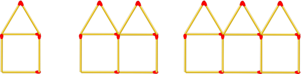

# Area of a Triangle

This challenge will help you interpret mathematical relationships both algebraically and geometrically.



Create a function that takes a number (step) as an argument and returns the number of matchsticks in that step. See step 1, 2 and 3 in the image above.

**Examples**

```
matchHouses(1) ➞ 6

matchHouses(4) ➞ 21

matchHouses(87) ➞ 436
```